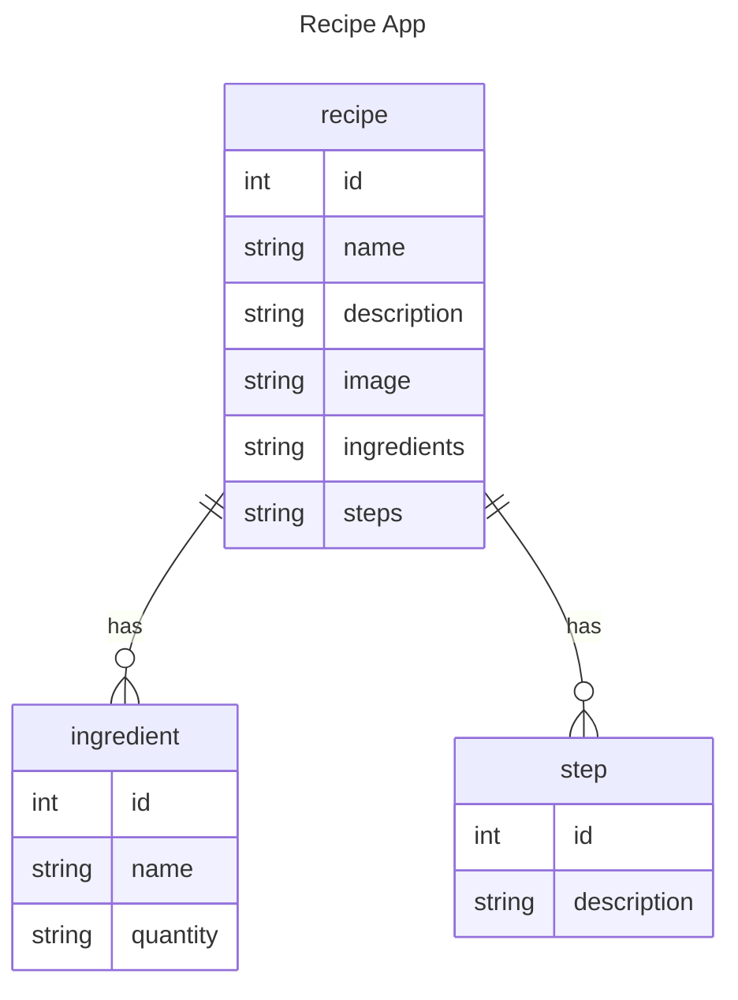

# Group 04 PWA
Used the following tutorial and base code
### [How to build a PWA from scratch with HTML, CSS, and JavaScript](https://www.ibrahima-ndaw.com/blog/how-to-build-pwa-with-javascript/)


# PWA
This repository includes a PWA where you can see different coffees. The idea is that in the future you can upload your own.
It uses Cache API and IndexedDB API

## Usage
The app is uploaded in the following [page](https://iic3585-2024.github.io/pwa-group-04/#). Right now you can't test it locally.

The initial elements are loaded in a cache and there is a IndexedDB API where the coffees you clicked are saved.

## Data Modeling:



Example:

```json
{
  "recipes": [
    {
      "id": 1,
      "name": "Coffee",
      "description": "",
      "ingredients": [
        {
          "id": 1,
          "name": "Café",
          "quantity": "1"
        },
        {
          "id": 2,
          "name": "Water",
          "quantity": "1"
        }
      ],
      "step": [
        {
          "id": 1,
          "description": "Boil Water"
        },
        {
          "id": 2,
          "description": "Add Coffee"
        }
      ]
    },
    {
      "id": 2,
      "name": "Coffee with milk",
      "description": "",
      "ingredients": [
        {
          "id": 1,
          "name": "Café",
          "quantity": "1"
        },
        {
          "id": 2,
          "name": "Water",
          "quantity": "1"
        },
        {
          "id": 3,
          "name": "Milk",
          "quantity": "1"
        }
      ],
      "step": [
        {
          "id": 1,
          "description": "Boil Water"
        },
        {
          "id": 2,
          "description": "Add Coffee"
        },
        {
          "id": 3,
          "description": "Add milk"
        }
      ]
    }
  ],
}
